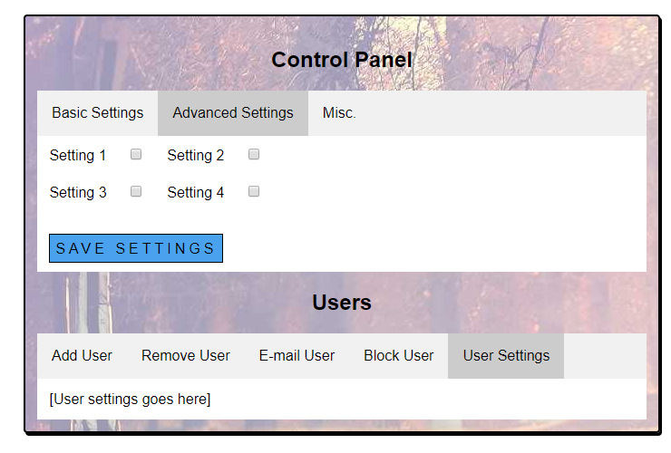

# HTML Dynamic Tabmenu code snippet

Dynamic Tabmenu for HTML (jQuery)

## Requirements
* jQuery library

## Usage

Create a following structure in HTML:
```
<div class="tab-menu-container">
  <div class="tab-menu">
    <div class="tab active">Tab 1 Label</div>
    <div class="tab">Tab 2 Label</div>
    <div class="tab">Tab 3 Label</div>
  </div>

  <div class="tab-content-1">Tab 1 content</div>
  <div class="tab-content-2" style="display: none;">Tab 2 content</div>
  <div class="tab-content-3" style="display: none;">Tab 3 content</div>
</div>
```

Add this jQuery code:
```javascript
// Dynamic tab menu
$(document).on("click",".tab-menu .tab",function(){
	var tabIndex = $(this).index();
	elTabMenu = $(this).parent("div");
	elTabContent = elTabMenu.parent("div");

	// Switch to active tab
	elTabMenu.children("div").each(function(index) {			
		if( tabIndex != index )
			$(this).removeClass("active");
		else
			$(this).addClass("active");
	});

	// Show active tab content
	for( i = 1; i < elTabContent.children("div").length; i++ ) {
		if( tabIndex + 1 == i)
			elTabContent.children("div").eq(i).show();
		else
			elTabContent.children("div").eq(i).hide();
	}
});
```

And of course some styling with CSS:
```
.tab-menu {
  background-color: #f1f1f1;
  border: 1px solid #ccc;
}

.tab {
	background-color: inherit;
	float: left;
	border: none;
	cursor: pointer;
	padding: 1em 1em;
	transition: 0.7s;
}

.tab:hover {
	background-color: #ddd;
}

.tab.active {
	background-color: #ccc;
}

div[class*="tab-content-"] {
	clear: both;
}
```
## Example usage with 2 tabmenus (and very lazy CSS ;)

